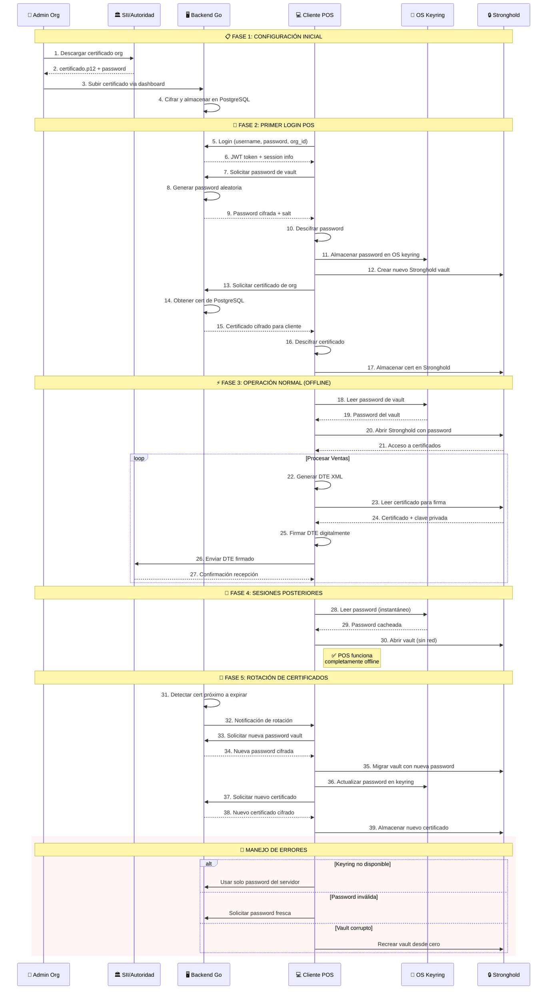

# Architecture Decision: Certificate Management with Local Vault

**Date**: June 13, 2025  
**Status**: Planned  
**Decision**: Implement secure certificate management using Tauri Stronghold for offline DTE signing.

## Context

DTE (Electronic Tax Documents) in El Salvador require digital signatures for every transaction. Traditional approaches either:
- Store certificates on server (requires constant connectivity)
- Store certificates in plain text locally (security risk)
- Require hardware tokens (expensive and complex)

We need a solution that:
- Works completely offline after initial setup
- Protects private keys securely
- Allows certificate rotation without downtime
- Scales to thousands of POS terminals

## Decision

Implement a 5-phase certificate management system using:
- **Tauri Stronghold**: Encrypted local vault for certificates
- **OS Keyring**: Secure password storage (Windows Credential Manager, macOS Keychain, Linux Secret Service)
- **Server-side encryption**: PostgreSQL storage for organization certificates
- **Automatic rotation**: Proactive certificate renewal

## Architecture Flow



## Implementation Details

### Phase 1: Initial Configuration
```go
// Backend: Store encrypted certificate
type CertificateStorage struct {
    OrgID       string
    Certificate []byte // AES-256 encrypted
    Password    []byte // Encrypted with org key
    ExpiryDate  time.Time
    CreatedBy   string
}
```

### Phase 2: First POS Login
```rust
// Tauri: Create local vault
use tauri_plugin_stronghold::Builder;

async fn setup_vault(password: String) -> Result<()> {
    let stronghold = Builder::new()
        .password(password.clone())
        .build()?;
    
    // Store password in OS keyring
    keyring::Entry::new("pos-inteligente", "vault-password")
        .set_password(&password)?;
    
    Ok(())
}
```

### Phase 3: Normal Operation (Offline)
```rust
// Sign DTE completely offline
async fn sign_dte_offline(xml: String) -> Result<SignedDTE> {
    // 1. Get password from keyring (no network)
    let password = keyring::Entry::new("pos-inteligente", "vault-password")
        .get_password()?;
    
    // 2. Open vault (local operation)
    let vault = open_stronghold(password)?;
    
    // 3. Get certificate from vault
    let cert = vault.get_certificate("org-cert")?;
    
    // 4. Sign XML
    let signed = sign_xml_with_cert(xml, cert)?;
    
    Ok(signed)
}
```

### Phase 5: Certificate Rotation
```go
// Backend: Monitor expiration
func (s *CertService) CheckExpiration() {
    certs := s.getExpiringCertificates(30) // 30 days warning
    
    for _, cert := range certs {
        s.notifyPOSTerminals(cert.OrgID, "CERT_EXPIRING")
    }
}
```

## Security Measures

1. **Defense in Depth**
   - Server: PostgreSQL encryption at rest
   - Transit: TLS + additional encryption layer
   - Client: Stronghold vault + OS keyring

2. **Zero Trust**
   - Each POS has unique vault password
   - Passwords never stored in plain text
   - Automatic rotation before expiry

3. **Offline First**
   - After setup, no internet required for signing
   - Critical for reliability in El Salvador

## Benefits

1. **Complete Offline Operation**: Sign DTEs without internet
2. **Strong Security**: Private keys never exposed
3. **Automatic Management**: Rotation handled transparently
4. **Cross-Platform**: Works on Windows, macOS, Linux
5. **Scalable**: Each POS manages its own vault

## Trade-offs

### Pros
- True offline capability after setup
- Military-grade encryption (Stronghold)
- OS-level security integration
- Automatic certificate lifecycle

### Cons
- Complex initial setup
- Requires OS keyring support
- Vault corruption requires re-sync
- Storage overhead per terminal

## Error Handling

1. **Keyring Unavailable**: Fallback to server-provided password
2. **Invalid Password**: Request fresh password from server
3. **Corrupted Vault**: Recreate from server backup
4. **Expired Certificate**: Queue DTEs until rotation

This architecture ensures POS terminals can operate independently while maintaining the highest security standards for digital certificates.